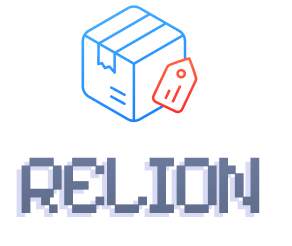

<div align="center">
	<picture>
		<source media="(prefers-color-scheme: dark)" srcset=".github/logo-light.png">
		
	</picture>
	<br>
	<a href="https://www.npmjs.com/package/relion"></a>&nbsp;
	<a href="https://www.npmjs.com/package/relion"></a>&nbsp;
	<a href="https://github.com/kh4f/relion/blob/master/LICENSE"></a>&nbsp;
	<a href="https://github.com/kh4f/relion/issues?q=is%3Aissue+is%3Aopen+label%3Abug"></a>
	<br><br>
	<b>A minimal npm library for automating release workflow:<br></b> version bumping, release commit & tag creation, and AI‑assisted changelog generation
	<br><br>
	<p><b>
		<a href="#-installation">Installation</a>&nbsp; •&nbsp;
		<a href="#%EF%B8%8F-cli-usage">CLI</a>&nbsp; •&nbsp;
		<a href="#-api-usage">API</a>&nbsp; •&nbsp;
		<a href="#%EF%B8%8F-workflow-steps">Workflow Steps</a>&nbsp; •&nbsp;
		<a href="#-changelog-generation">Changelog Generation</a>
	</b></p>
	<br>
</div>

## 📥 Installation

```bash
pnpm add -D relion
```

## 🕹️ CLI Usage

```bash
$ pnpm relion -h

Usage: relion [options]

Options:
  -f            Prepare release context
  -b            Bump the version
  -c            Create a release commit
  -t            Create a release tag
  -v <version>  Set the new version explicitly
  -m <file>     Specify manifest file
  -d            Run in dry run mode
  -h            Show the help message

Examples:
- `pnpm relion -bct` — bump version, create release commit and tag
- `pnpm relion -f` — generate release context file
- `pnpm relion -m Cargo.toml` — use Cargo.toml as manifest
- `pnpm relion` — run all release steps
```

<details><summary>Example output of running <code>pnpm relion</code>:</summary>

```txt
------------------------------
Current version: 0.36.1
Current tag: v0.36.1
Parsed commits: 16
New version: 0.37.0
New tag: v0.37.0
Commit message: 'chore(release): v0.37.0'
Repo URL: https://github.com/kh4f/relion
------------------------------

About to write context to 'RELEASE.md'
Press Enter to continue ('s' to skip):

About to bump versions in files: package.json
Press Enter to continue ('s' to skip):

About to commit changes: 'git commit -m "chore(release): v0.37.0"'
Press Enter to continue ('s' to skip):

About to create a tag: 'git tag v0.37.0 -m "chore(release): v0.37.0"'
Press Enter to continue ('s' to skip):
```
</details>

## 🧩 API Usage

```ts
import relion from 'relion';

relion({
	flow: ['context', 'bump', 'commit', 'tag'],
	newVersion: '1.2.3',
	bump: [
		'package.json', // uses default bumper
		// custom bumper (equivalent to the default bumper implementation)
		{
			file: 'manifest.json',
			pattern: /("version": )".*"/,
			replacement: '$1"{{newVersion}}"'
		}
	],
	contextFile: 'RELEASE.md',
	commitMessage: 'chore(release): {{tag}}',
	tagPrefix: 'v',
	dryRun: false,
});
```

### Options

- `manifest`: manifest file (default: auto-detects `package.json` or `Cargo.toml`)
- `flow`: release workflow steps (`'context' | 'bump' | 'commit' | 'tag'`) (default: `[]`)
- `newVersion`: set the new version explicitly
- `bump`: files or custom bumpers for version update (default: [`'package.json', 'Cargo.toml'`])
- `contextFile`: path to release context output file (default: `'RELEASE.md'`)
- `commitMessage`: release commit message template (default: `'chore(release): {{tag}}'`)
- `tagPrefix`: release tag prefix (default: `'v'`)
- `dryRun`: run in dry mode (no modifications)

### Configuration via `package.json`

Relion can also be configured via `relion` field in `package.json`:

```jsonc
{
  // ...
  "relion": {
    "commitMessage": "release(relion): {{tag}}",
    "tagPrefix": "",
    "bump": ["package.json",
	  {
	    "file": "manifest.json",
	    "pattern": "/(\"version\": )\".*\"/",
	    "replacement": "$1\"{{newVersion}}\""
	  }
	],
    // ...
  }
}
```

> [!NOTE]
> CLI flags override `package.json` configuration.

## ♻️ Workflow Steps

- **Context**: generates a file with upcoming release metadata and commit log
- **Bump**: updates version in specified files
- **Commit**: creates a release commit
- **Tag**: creates an annotated release tag

<details><summary>Generated release context example (*):</summary>

```md
---
version: 0.33.0
tag: v0.33.0
date: Jan 10, 2026
prevTag: v0.32.1
repoURL: https://github.com/kh4f/relion
---

## Commit Log

[8f29acf] fix(versioner): ensure breaking changes take priority over features in release type calculation

Previously, if commits contained both features and breaking changes, features would be checked last and could incorrectly override the 'major' release type with 'minor'.
------------------------------
[e105d51] feat(config-merger): add `mergeConfigs` implementation and export

- Implement `mergeConfigs` to support merging config profiles in `config-merger.ts`
- Export `mergeConfigs` from `src/index.ts`
------------------------------
```
</details>

## 📚 Changelog Generation

Relion doesn’t format the changelog itself — it produces a release context that can be turned into a user‑friendly changelog with AI.

Recommended workflow:

1. Set up GitHub Copilot instruction and prompt:
   - [.github/instructions/changelog-format.instructions.md](.github/instructions/changelog-format.instructions.md)
   - [.github/prompts/generate-changelog.prompt.md](.github/prompts/generate-changelog.prompt.md)
2. Run the context step to generate RELEASE.md: `pnpm relion -f`
3. Review the release context, adjust as needed
4. Run the prompt in VSCode Copilot chat: `/generate-changelog`
5. Copilot produces a polished changelog entry based on the release context

<details><summary>Generated changelog example (from the (*) release context using the instruction and prompt above; Gemini 3 Pro)</summary>

```md
## &ensp; [` 📦 v0.33.0  `](https://github.com/kh4f/relion/compare/v0.32.1...v0.33.0)

### &emsp; 🎁 Features
- **Config merging utility**: added `mergeConfigs` implementation to support merging config profiles. [🡥](https://github.com/kh4f/relion/commit/e105d51)

### &emsp; 🩹 Fixes
- **Correct release type calculation**: breaking changes now correctly take priority over features when determining the release type, preventing incorrect minor bumps. [🡥](https://github.com/kh4f/relion/commit/8f29acf)

##### &emsp;&emsp; [Full Changelog](https://github.com/kh4f/relion/compare/v0.32.1...v0.33.0) &ensp;•&ensp; Jan 10, 2026
```
</details>

</br>

<div align="center">
  <b>MIT License © 2025-2026 <a href="https://github.com/kh4f">kh4f</a></b>
</div>